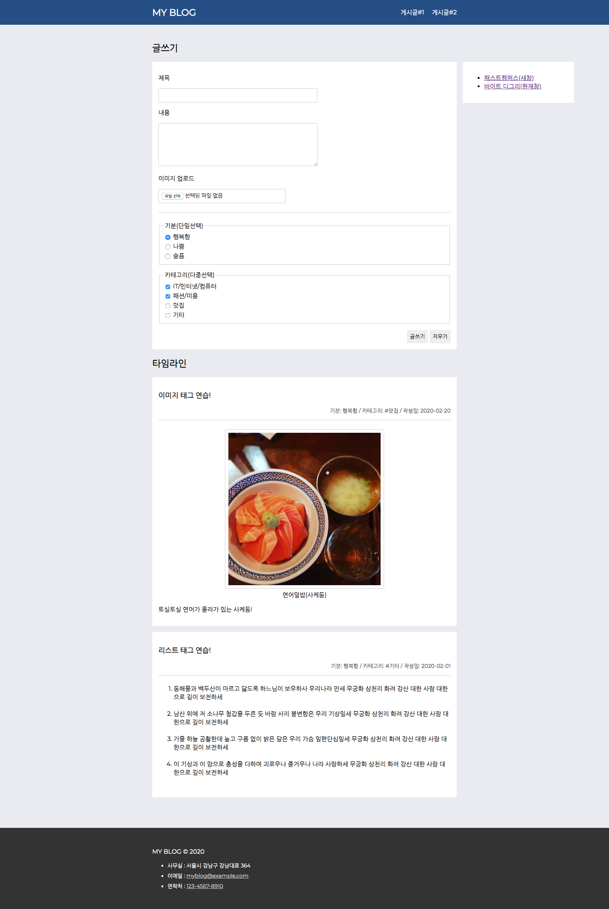
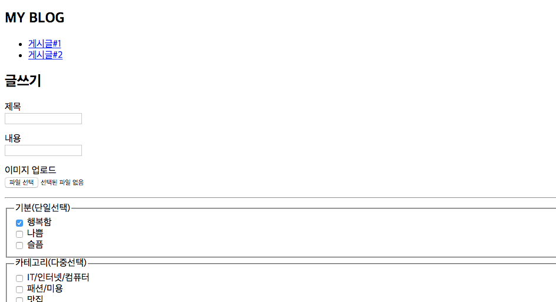
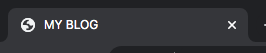
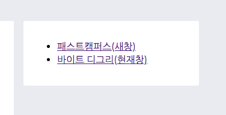
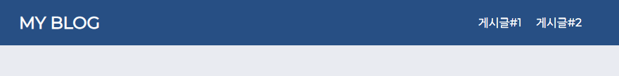
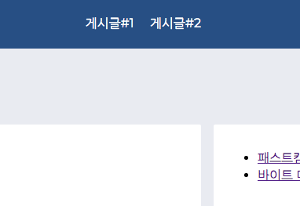
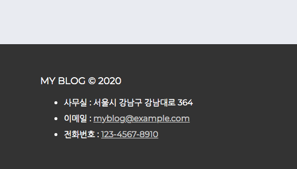
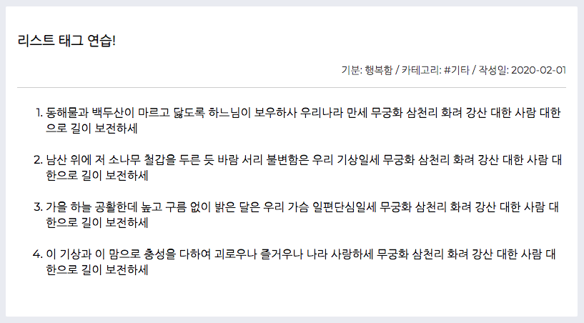
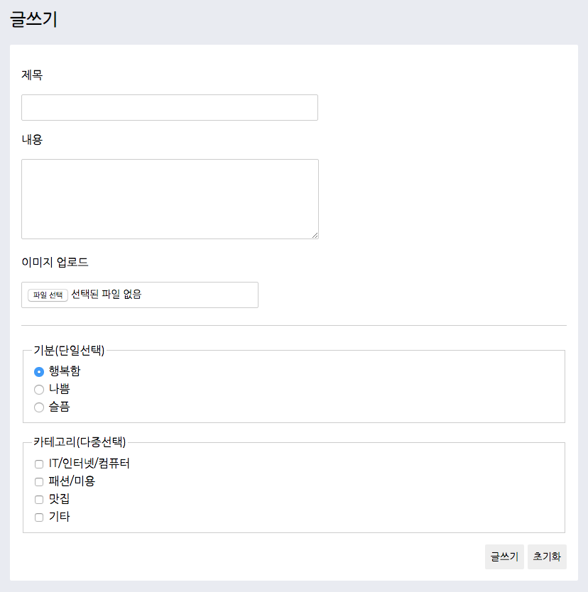

# HTML 구성요소를 이용하여 웹 사이트 구조 만들기

학습한 HTML 요소들을 활용하여 웹 사이트 구조를 완성시켜 볼 것 입니다.  
본 과제에서는 웹 사이트의 모양보다는 HTML의 각 요소와 속성을 사용하는 방법에 중점을 두었습니다.  
아래 문제를 잘 읽어보시고 풀어주세요.

## 시작하기 전에..

`VSCode`를 사용하고 계신다면 `Cmd(Ctrl) + K, V` 키를 입력하시면 `markdown` 문서뷰어로 더 쉽게 확인하실 수 있습니다.

### 브라우저

HTML5을 지원하는 최신 브라우저 또는 [Google Chrome](https://www.google.com/chrome) 브라우저에서 과제를 진행해 주세요!

### 완성된 웹 사이트 스크린샷 확인하기

완성된 웹 사이트 모양은 아래와 이미지와 같습니다.  
HTML 구조 이해를 돕기위해 문제 풀이에 방해가 되지 않을 정도의 CSS를 추가하여 웹 사이트의 스타일을 만들어 두었습니다.  
문제를 조금씩 풀어나가다 보면 아래 스크린샷과 같이 사이트가 완성되는 것을 보실 수 있습니다.

_참고 이미지: 완성된 웹 사이트 스크린샷_  

## 문제풀기

### 01. 기본경로 설정하기

[index.html](./src/index.html#L7) 파일을 브라우저에서 열어 확인해 보시면 정적 자원(CSS, Images) 경로에서 에러가 발생하여 아래 이미지와 같이 페이지가 제대로 노출되지 않고 있습니다.  
문서에서 사용되는 상대 경로 기준를 `./assets/`으로 설정하여 CSS와 이미지를 제대로된 경로에서 불러올 수 있게 수정해 주세요!

_참고 이미지: 스타일 시트가 적용되지 않은 웹 사이트_  

-   (주의) CSS, 이미지 경로를 직접 변경하시면 안됩니다!

[!] 아래 링크를 클릭하시면 소스코드로 이동 합니다.

-   [태그 입력 위치](./src/index.html#L7)

-   잘 기억이 나지 않는다면?
    -   [메타데이터 - BASE](https://www.fastcampus.co.kr/online/#/courses/201133/clips/10592) 강의를 다시 확인해 보세요!
    -   [MDN 문서 참고하기 - base](https://developer.mozilla.org/ko/docs/Web/HTML/Element/base)

---

### 02. 브라우저 타이틀 표시하기

아래 이미지와 같이 브라우저 타이틀 정보에 `"MY BLOG"`가 노출되게 해주세요!

_참고 이미지: 브라우저 타이틀_  

[!] 아래 링크를 클릭하시면 소스코드로 이동 합니다.

-   [태그 입력 위치](./src/index.html#L13)

-   잘 기억이 나지 않는다면?
    -   [주요범위 & 메타데이터 - HTML, HEAD, BODY, TITLE](https://www.fastcampus.co.kr/online/#/courses/201133/clips/10586) 강의를 다시 확인해 보세요!
-   [MDN 문서 참고하기 - title](https://developer.mozilla.org/ko/docs/Web/HTML/Element/title)

---

### 03. 시멘틱 구성요소 사용하기

#### 03-01. 헤더, 본문, 푸터 영역을 감싸고 있는 `div`를 적절한 태그로 바꿔주세요.

[!] 아래 링크를 클릭하시면 소스코드로 이동 합니다.

-   [헤더 태그 위치](./src/index.html#L18)
-   [본문 태그 위치](./src/index.html#L34)
-   [푸터 태그 위치](./src/index.html#L222)

-   잘 기억이 나지 않는다면?
    -   [콘텐츠 구분 - HEADER](https://www.fastcampus.co.kr/online/#/courses/201133/clips/12102), [FOOTER](https://www.fastcampus.co.kr/online/#/courses/201133/clips/12103), [MAIN](https://www.fastcampus.co.kr/online/#/courses/201133/clips/10597) 강의를 다시 확인해 보세요!
    -   [MDN 문서 참고하기 - header](https://developer.mozilla.org/ko/docs/Web/HTML/Element/header)
    -   [MDN 문서 참고하기 - footer](https://developer.mozilla.org/ko/docs/Web/HTML/Element/footer)
    -   [MDN 문서 참고하기 - main](https://developer.mozilla.org/ko/docs/Web/HTML/Element/main)

---

#### 03-02. 웹사이트 우측 링크 영역 `div`를 적절한 태그로 바꿔주세요.

웹사이트 우측 링크 영역은 메인 컨텐츠 내용과 조금 다른 성격을 가진 컨텐츠입니다 어떤 태그를 사용하면 좋을까요?

_참고 이미지: 우측 링크 영역_  

[!] 아래 링크를 클릭하시면 소스코드로 이동 합니다.

-   [우측 링크 영역 태그 위치](./src/index.html#L202)

-   잘 기억이 나지 않는다면?
    -   [콘텐츠 구분 - NAV](https://www.fastcampus.co.kr/online/#/courses/201133/clips/10600) 강의를 다시 확인해 보세요!
    -   [MDN 문서 참고하기 - nav](https://developer.mozilla.org/ko/docs/Web/HTML/Element/nav)

---

#### 03-03. 게시글 카드 영역 `div`를 적절한 태그로 바꿔주세요.

[!] 아래 링크를 클릭하시면 소스코드로 이동 합니다.

-   [게시글 1번 태그 위치](./src/index.html#L138)
-   [게시글 2번 태그 위치](./src/index.html#L166)

-   잘 기억이 나지 않는다면?
    -   [콘텐츠 구분 - ARTICLE](https://www.fastcampus.co.kr/online/#/courses/201133/clips/10603) 강의를 다시 확인해 보세요!
    -   [MDN 문서 참고하기 - article](https://developer.mozilla.org/ko/docs/Web/HTML/Element/article)

---

#### 03-04. 헤더 영역의 제목을 표시하고 있는 `h2` 태그를 적절한 태그로 바꿔주세요.

_참고 이미지: 사이트 제목_  

[!] 아래 링크를 클릭하시면 소스코드로 이동 합니다.

-   [h2 태그 위치](./src/index.html#L20)

-   잘 기억이 나지 않는다면?
    -   [콘텐츠 구분 - H1~H6](https://www.fastcampus.co.kr/online/#/courses/201133/clips/10596) 강의를 다시 확인해 보세요!
    -   [MDN 문서 참고하기 - h1~h6](https://developer.mozilla.org/ko/docs/Web/HTML/Element/Heading_Elements)

---

### 04. 앵커(A) 태그 활용하기

#### 04-01. 외부 사이트 연결하기

웹 사이트 우측 사이드 메뉴의 `패스트캠퍼스(새창)`을 클릭하면 새로운 창에서 페이지 이동이 되게하고, `바이트 디그리(현재창)`을 클릭하면 현재 창에서 페이지 이동이 될 수 있도록 속성 값을 수정해 주세요!

_참고 이미지: 우측 사이드 링크_  

[!] 아래 링크를 클릭하시면 소스코드로 이동 합니다.

-   [패스트캠퍼스 링크 위치](./src/index.html#L206)
-   [바이트 디그리 링크 위치](./src/index.html#L212)

-   잘 기억이 나지 않는다면?
    -   [인라인 텍스트 - A 1](https://www.fastcampus.co.kr/online/#/courses/201133/clips/10610) 강의를 다시 확인해 보세요!
    -   [MDN 문서 참고하기 - a](https://developer.mozilla.org/ko/docs/Web/HTML/Element/a)

---

#### 04-02. 현재 페이지 컨텐츠로 연결하기(해시)

웹 사이트 상단 네비게이션에서 `게시글#1, 게시글#2`를 클릭했을때 각 게시글 위치로 스크롤 되도록 `href` 속성 값을 수정해 주세요!

_참고 이미지: 상단 링크_  

[!] 아래 링크를 클릭하시면 소스코드로 이동 합니다.

-   [게시글#1 링크 위치](./src/index.html#L24)
-   [게시글#2 링크 위치](./src/index.html#L27)

-   잘 기억이 나지 않는다면?
    -   [인라인 텍스트 - A 2](https://www.fastcampus.co.kr/online/#/courses/201133/clips/10611) 강의를 다시 확인해 보세요!
    -   [MDN 문서 참고하기 - a](https://developer.mozilla.org/ko/docs/Web/HTML/Element/a)

---

#### 04-03. 전화번호, 이메일 연결하기

웹사이트 하단 `이메일, 전화번호` 링크가 올바르게 동작하도록 `href` 속성 값을 수정해 주세요!

_참고 이미지: 하단 링크_  

[!] 아래 링크를 클릭하시면 소스코드로 이동 합니다.

-   [이메일 링크 위치](./src/index.html#L230)
-   [전화번호 링크 위치](./src/index.html#L236)

-   잘 기억이 나지 않는다면?
    -   [인라인 텍스트 - A 2](https://www.fastcampus.co.kr/online/#/courses/201133/clips/10611) 강의를 다시 확인해 보세요!
    -   [MDN 문서 참고하기 - a](https://developer.mozilla.org/ko/docs/Web/HTML/Element/a)

---

### 05. 리스트 속성 활용하기

"리스트 태그 연습!" 게시글 컨텐츠에 작성된 애국가 각 절 앞에 노출되는 현재 정렬 순서 `"A, B, C, D"` 대신 `"1, 2, 3, 4"`가 노출되도록 `type` 속성 값을 수정해 주세요!

_참고 이미지: 목록 순서 - 숫자, 오름차순_  

[!] 아래 링크를 클릭하시면 소스코드로 이동 합니다.

-   [리스트 태그 위치](./src/index.html#L177)

-   잘 기억이 나지 않는다면?
    -   [문자 콘텐츠 - OL, UL, LI](https://www.fastcampus.co.kr/online/#/courses/201133/clips/10605) 강의를 다시 확인해 보세요!
    -   [MDN 문서 참고하기 - ol](https://developer.mozilla.org/ko/docs/Web/HTML/Element/ol)

---

### 06. Form 태그 구성요소 활용하기

_참고 이미지: 글쓰기 영역_  

#### 06-01. 멀티라인 텍스트

"글쓰기" 영역 `내용` 입력란을 멀티라인 텍스트가 입력될 수 있도록 태그를 수정해 주세요!

[!] 아래 링크를 클릭하시면 소스코드로 이동 합니다.

-   [내용 입력 태그 위치](./src/index.html#L49)

-   잘 기억이 나지 않는다면?
    -   [양식 - TEXTAREA](https://www.fastcampus.co.kr/online/#/courses/201133/clips/10649) 강의를 다시 확인해 보세요!
    -   [MDN 문서 참고하기 - textarea](https://developer.mozilla.org/ko/docs/Web/HTML/Element/textarea)

---

#### 06-01. 단일선택

"글쓰기" 영역 `기분(단일선택)` 항목을 단일선택만 가능하도록 태그 속성 값을 수정해 주세요!

[!] 아래 링크를 클릭하시면 소스코드로 이동 합니다.

-   [선택 항목 1 태그 위치](./src/index.html#L69)
-   [선택 항목 2 태그 위치](./src/index.html#L77)
-   [선택 항목 3 태그 위치](./src/index.html#L84)

-   잘 기억이 나지 않는다면?
    -   [양식 - INPUT 2](https://www.fastcampus.co.kr/online/#/courses/201133/clips/10646) 강의를 다시 확인해 보세요!
    -   [MDN 문서 참고하기 - input](https://developer.mozilla.org/ko/docs/Web/HTML/Element/input)

---

#### 06-01. 버튼 유형

"글쓰기" 영역 하단에 위치한 `글쓰기, 초기화` 버튼 `type` 속성을 알맞은 값으로 수정해 주세요!

[!] 아래 링크를 클릭하시면 소스코드로 이동 합니다.

-   [글쓰기 버튼 태그 위치](./src/index.html#L128)
-   [초기화 버튼 태그 위치](./src/index.html#L129)

-   잘 기억이 나지 않는다면?
    -   [양식 - BUTTON](https://www.fastcampus.co.kr/online/#/courses/201133/clips/10648) 강의를 다시 확인해 보세요!
    -   [MDN 문서 참고하기 - button](https://developer.mozilla.org/ko/docs/Web/HTML/Element/button)

---

### 07. 이미지 태그 활용하기

#### 07-02. 이미지 경로 설정

"이미지 태그 연습!" 게시글 컨텐츠로 작성된 이미지 태그에서 이미지 경로를 찾을 수 없는 경우 이미지를 대체하는 텍스트로 `연어덮밥(사케동)`으로 노출될 수 있도록 소스코드를 수정해 주세요!

[!] 아래 링크를 클릭하시면 소스코드로 이동 합니다.

-   [이미지 태그 위치](./src/index.html#L150)

-   잘 기억이 나지 않는다면?
    -   [멀티미디어 - IMG 1](https://www.fastcampus.co.kr/online/#/courses/201133/clips/10626) 강의를 다시 확인해 보세요!
    -   [MDN 문서 참고하기 - img](https://developer.mozilla.org/ko/docs/Web/HTML/Element/img)

---

#### 07-02. 이미지 경로 설정

"이미지 태그 연습!" 게시글 컨텐츠로 작성된 이미지 태그에서 `srcset` 속성을 사용할 수 없는 환경인 경우 이미지 폴더내 `image-lg.jpg` 이미지가 노출 될 수 있도록 소스코드를 수정해 주세요!

[!] 아래 링크를 클릭하시면 소스코드로 이동 합니다.

-   [이미지 태그 위치](./src/index.html#L150)

-   잘 기억이 나지 않는다면?
    -   [멀티미디어 - IMG 2 - srcset, sizes 속성](https://www.fastcampus.co.kr/online/#/courses/201133/clips/10627) 강의를 다시 확인해 보세요!
    -   [MDN 문서 참고하기 - img](https://developer.mozilla.org/ko/docs/Web/HTML/Element/img)
